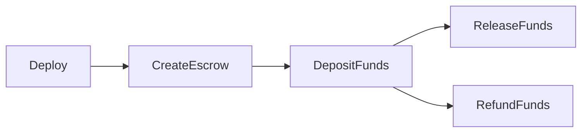
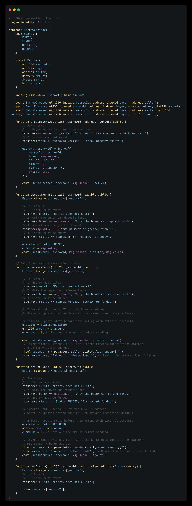
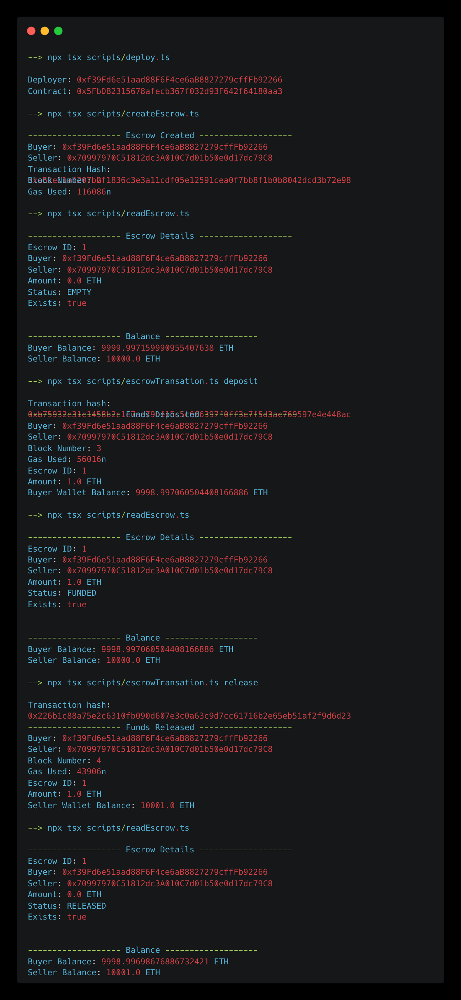
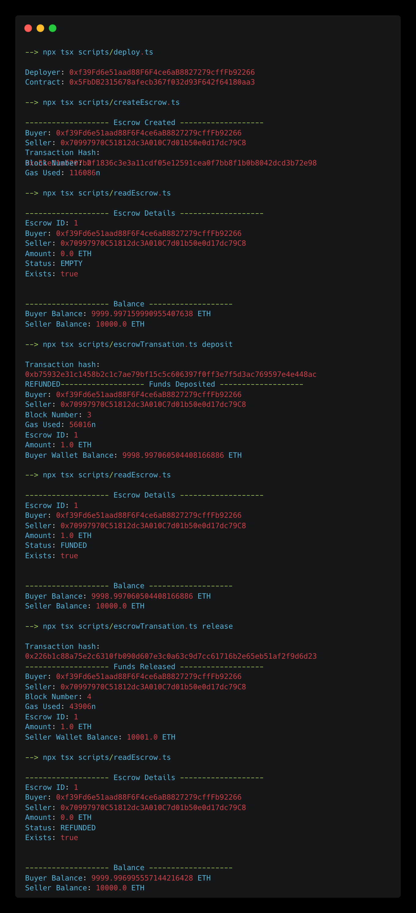

# Escrow Contract

A small Ethereum escrow smart contract plus a TypeScript CLI. The contract holds the buyer’s ETH until the deal is settled — then pays the seller or refunds the buyer — without trusting a seller or a centralized platform.





## What is an escrow?

An escrow is a middleman that holds the buyer’s Ethereum until the transaction conditions are met. Instead of sending money straight to the seller (or trusting a centralized marketplace), the **blockchain contract itself** controls when funds go to the seller or back to the buyer.

In this project:

1. Buyer creates an escrow with a seller address  
2. Buyer deposits ETH into the contract (`EMPTY` → `FUNDED`)  
3. Buyer either **releases** funds to the seller or **refunds** themselves  

## How the contract works

Contract: [`contracts/EscrowContract.sol`](contracts/EscrowContract.sol)

Each escrow stores:

| Field | Meaning |
|-------|---------|
| `escrowId` | Unique ID |
| `buyer` | Creator / funder (msg.sender on create) |
| `seller` | Payout address on release |
| `amount` | ETH locked in the escrow |
| `status` | `EMPTY` → `FUNDED` → `RELEASED` or `REFUNDED` |
| `exists` | Whether this ID was created |

### Status flow

`EMPTY` → deposit → `FUNDED` → release → `RELEASED`  
                   ↘ refund → `REFUNDED`

### Required checks

#### `createEscrow(escrowId, seller)`

- Buyer and seller cannot be the same (`msg.sender != seller`)
- Escrow ID must not already exist (`!escrows[id].exists`)

Creates the escrow with `amount = 0` and status `EMPTY`. Emits `EscrowCreated`.

#### `depositFunds(escrowId)` (payable)

- Escrow must exist
- Only the buyer can deposit
- `msg.value` must be greater than 0
- Status must be `EMPTY`

Sets status to `FUNDED` and stores the amount. Emits `FundsFunded`.

#### `releaseFunds(escrowId)`

- Escrow must exist
- Only the buyer can release
- Status must be `FUNDED`

Uses checks-effects-interactions: status → `RELEASED`, amount zeroed, then ETH sent to the seller. Emits `FundsReleased`. Reverts if the transfer fails.



#### `refundFunds(escrowId)`

- Escrow must exist
- Only the buyer can refund
- Status must be `FUNDED`

Same CEI pattern: status → `REFUNDED`, amount zeroed, then ETH returned to the buyer. Emits `FundsRefunded`. Reverts if the transfer fails.



#### `getEscrow(escrowId)` (view)

- Escrow must exist

Returns the full escrow struct.

### Events

| Event | When |
|-------|------|
| `EscrowCreated` | After create |
| `FundsFunded` | After deposit |
| `FundsReleased` | After release to seller |
| `FundsRefunded` | After refund to buyer |

## Project setup

1. Install dependencies:

```bash
npm install
```

2. Create your environment file:

```bash
cp .env.example .env
```

3. Fill in `.env`:

| Variable | Purpose |
|----------|---------|
| `RPC_URL` | JSON-RPC endpoint (e.g. `http://127.0.0.1:8545`) |
| `BUYER_PRIVATE_KEY` | Buyer — deploy, create, deposit, release, refund |
| `SELLER_PRIVATE_KEY` | Seller address used on create / release |
| `CONTRACT_ADDRESS` | Set automatically by CLI deploy |

For local Hardhat, the default accounts work as buyer/seller keys.

4. Compile (if needed):

```bash
npx hardhat compile
```

5. Start a local node (separate terminal) if using Hardhat:

```bash
npx hardhat node
```

## CLI usage (recommended)

Everything runs through the CLI:

```bash
npm run cli
```

On launch you see **buyer private key**, **seller private key**, and **contract address** (keys masked). Menu:

1. **Deploy contract** — deploys and writes `CONTRACT_ADDRESS` into `.env`  
2. **Create escrow** — prompts for escrow ID; seller is fetched from `SELLER_PRIVATE_KEY` in `.env`  
3. **Escrow transactions** — submenu: Deposit / Release / Refund  
4. **Read escrow** — prints ID, parties, amount, status, exists, and balances  
5. **Exit**

### Non-interactive commands

```bash
npm run cli -- deploy
npm run cli -- create --escrowId 1
npm run cli -- deposit --escrowId 1 --amount 1
npm run cli -- release --escrowId 1
npm run cli -- refund --escrowId 1
npm run cli -- read --escrowId 1
```

### Missing config

- Missing `CONTRACT_ADDRESS` → CLI offers to deploy and updates `.env`
- Missing `RPC_URL` / keys → CLI prompts and can write them into `.env`

## Manual scripts (optional)

One-off scripts (same env vars):

```bash
npx tsx scripts/deploy.ts
npx tsx scripts/createEscrow.ts
npx tsx scripts/escrowTransation.ts deposit   # or: release | refund
npx tsx scripts/readEscrow.ts
```

Note: those scripts use hardcoded escrow ID `1` and deposit `1` ETH; prefer the CLI for dynamic values.
